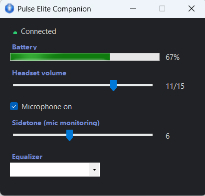

# Pulse Elite Companion (`pslink-libusb`)

A tiny Windows companion for the **Sony PlayStation Pulse Elite** wireless headset (via the
**PS Link** USB dongle) that does two things the official software can't:

1. **Fixes the USB-audio freeze** that plagues the PS Link dongle on Windows — audio stutters
   then dies, requiring a service restart — **without** any kernel driver or watchdog.
2. **Restores the headset controls** (sidetone, EQ, live volume/mic status) from a lightweight
   system-tray app, so you don't need the official "PlayStation Link" desktop app running.

> Not affiliated with, endorsed by, or supported by Sony. Use at your own risk.
> "Pulse Elite Companion" is the friendly name; `pslink-libusb` is the technical/repo name.

<p align="center"></p>

---

## The problem

On Windows, the older PS Link dongle — model **CFI-ZWA2** (`VID 054C / PID 0ECC`) — periodically
**freezes the audio graph**: `audiodg` locks up, sound cuts out, and only restarting the audio
service recovers it. It happens passively during playback and is **accelerated** by pressing the
headset's volume/mute buttons — in the worst case it dies within **seconds** of button mashing
during exclusive-mode playback.

> **Which adapter needs this?** The freeze is specific to the older **CFI-ZWA2** adapter (`PID_0ECC`).
> A newer revision, **ZFI-ZWA3** (`PID_0FA3`), does **not** exhibit the freeze in testing — if you
> have that one, you don't need this fix. Note that both report the same firmware number
> (`bcdDevice 1.43` / `REV_0143`), so tell them apart by **PID / model**, not by firmware version.
> Everything here was built and validated on the **CFI-ZWA2** (`0ECC`); the ZFI-ZWA3 has a different
> HID layout and was not reverse-engineered.

## What actually causes it

Live USB bus captures (USBPcap/Wireshark) pinned the cause:

- Every time the headset reports a state change, the dongle pushes a **256-byte transfer into a
  64-byte interrupt endpoint (`0x81`)** → `USBD_STATUS_BABBLE_DETECTED`. Windows' error recovery
  (abort/reset pipe) tears down the **isochronous audio stream on the same device**, and `audiodg`
  freezes.
- That interrupt endpoint is only ever polled because the in-box **HID driver (`HidUsb`)** keeps
  it open. Nothing about the audio path itself is broken.
- Meanwhile, the headset's **"a PC is here" presence** is kept alive by a completely separate
  mechanism: a **~5 Hz `GET_REPORT(Feature 0xB0)` control poll on endpoint 0** — not the interrupt
  pipe. (Verified: the headset stayed connected for 130 s with the interrupt pipe totally silent,
  as long as the EP0 poll kept running.)

## The fix

Rebind the dongle's HID interface (**MI_03**) from `HidUsb` to **WinUSB**, then talk to it from
user space:

- WinUSB **never opens the interrupt pipe `0x81` on its own** → the babble transfer never gets a
  pipe to land in → **no freeze**. (Confirmed: a scenario that froze in <10 s ran clean.)
- The app runs the **same ~5 Hz `GET_REPORT(0xB0)` control poll** → **presence is preserved**, the
  headset auto-syncs and stays connected. (This is mandatory and continuous — it's the keepalive,
  not just button latency.)
- Buttons keep working because volume/mute are applied **device-side** in the headset's own DSP.
- Sidetone and EQ are set via `SET_REPORT(0xD0)` control transfers (validated byte-for-byte from
  captures of the official app).

The in-box USB **audio** driver (`usbaudio` on MI_00) is left completely untouched — sound keeps
working normally.

## How it was built

Everything here was reverse-engineered from the real device — there is no vendor documentation.
The methodology, kept deliberately empirical:

- **Live USB bus captures** (USBPcap + Wireshark) of the official app talking to the dongle, to see
  exactly what crosses the wire. This is how the freeze cause (the babble on interrupt endpoint `0x81`)
  and the ~5 Hz EP0 keepalive poll that maintains presence were found.
- **HID / WinUSB probing from user space** (Python + pyusb/libusb): read the vendor feature reports and
  replay candidate commands while watching the device's own state bytes change. Sidetone, EQ, volume and
  mic-mute were each confirmed byte-for-byte this way; the battery level was decoded by reading report
  `0x82` and calibrating it against the percentage the official app displays.
- **A Python prototype validated every step on real hardware first** (freeze eliminated, presence held,
  read + write), and only then was the logic ported to the C#/.NET tray app. Those prototype tools stay
  in the repo so anyone can reproduce the findings.

The guiding rule throughout: prove each claim against the live device instead of assuming it.

## Status

| Piece | State |
|---|---|
| Audio freeze eliminated (WinUSB, interrupt pipe never opened) | ✅ |
| Presence / keepalive via EP0 control poll (auto-sync preserved) | ✅ |
| Read volume / mic / buttons / connection state | ✅ |
| Volume control from the app (device-side) | ✅ `0xD0` mask `0x02` |
| Mic mute from the app (device-side) | ✅ `0xD0` mask `0x01` |
| Sidetone + EQ | ✅ `0xD0` mask `0x40` / `0x04` |
| Battery indicator | ✅ report `0x82` |
| System-tray app + settings panel (sliders) | ✅ |
| Portable device discovery (any machine / any dongle) | ✅ |
| Localization — English / Português / Español | ✅ |
| Automated installer + own WinUSB INF (no Zadig needed) | ✅ |
| Start with Windows | ✅ |
| Packaged release (single-file exe, one-click installer) | ✅ |
| Idle auto-off when no audio is playing (configurable) | 🔬 evaluating |
| Microsoft-signed driver (to drop the self-signed cert) | 🚧 planned |

## Repository layout

- `app/PulseTray/` — the C#/.NET tray application (the deliverable).
- `winusb_proto.py` — the WinUSB prototype: 5 Hz keepalive poll + sidetone/EQ, never opens the
  interrupt pipe. `read_state.py`, `test_write.py`, `probe_volume_mic.py`, `probe_volume_map.py`,
  `app/pulse_device.py` — prototype/repro tools (pyusb + libusb) that validate the mechanism.

## Install

Requires Windows x64 and a PS Link dongle.

### Easy install (release bundle)

Download the release bundle, unzip it, and run **`setup.ps1`** (right-click → *Run with
PowerShell*). It installs the WinUSB driver (one UAC prompt — see the certificate note below),
copies the app to `%LOCALAPPDATA%\PulseEliteCompanion`, enables start-with-Windows, and launches it.

Maintainers build the bundle with `build-release.ps1` (publishes a self-contained, single-file,
compressed exe and zips it with `setup.ps1` + the driver files).

### Manual install (from source)

Requires the .NET SDK.

#### 1. Bind the dongle's control interface (MI_03) to WinUSB

Right-click `app/driver/install.ps1` → **Run with PowerShell** (or run it from a terminal):

```
powershell -ExecutionPolicy Bypass -File app\driver\install.ps1
```

It self-elevates (one UAC prompt) and, using only built-in Windows tools, installs the WinUSB
driver on **MI_03** with a fixed interface GUID. The USB **audio** interface (MI_00) is left
untouched — sound keeps working. To reverse everything, run `app/driver/uninstall.ps1`.

> ⚠️ **About the self-signed certificate — please read.**
> Windows x64 refuses to install an *unsigned* driver package. Since this is a hobby/community
> tool without a paid Microsoft-attestation signature, the installer **generates a self-signed
> code-signing certificate and adds it to your machine's Trusted Root and Trusted Publisher
> certificate stores** in order to sign and install our INF. This is the *same* trust concession
> the popular **Zadig** utility makes under the hood. Nothing is uploaded and no external service
> is involved — but a certificate that you generated locally becomes trusted by your machine.
> `app/driver/uninstall.ps1` removes the driver, reverts MI_03 to the in-box HID driver, **and
> deletes that certificate** from all three stores. A proper Microsoft-signed driver (no
> certificate step) is planned for a public release.

*Alternative (no installer):* bind MI_03 to WinUSB manually with [Zadig](https://zadig.akeo.ie)
(*Options → List All Devices* → "PlayStation Link … (Interface 3)", currently on **HidUsb** —
not the `USBAudio` one — target **WinUSB** → *Replace Driver*). The app auto-detects whichever
WinUSB binding is present, so either method works.

#### 2. Run the app

```
dotnet build app/PulseTray/PulseTray.csproj -c Debug
```
Launch `PulseElite.exe`; it lives in the system tray (green = connected). Left-click for the
settings panel; right-click for the quick menu. Enable **"Iniciar com o Windows"** for autostart.

*To verify the underlying mechanism without the app*, use the Python tools:
```
pip install pyusb libusb-package
py read_state.py --watch      # live button/volume readout
py winusb_proto.py            # 5 Hz keepalive + sidetone/EQ
```

## License

MIT — see [LICENSE](LICENSE).
